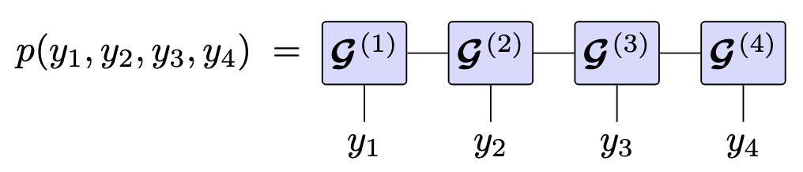
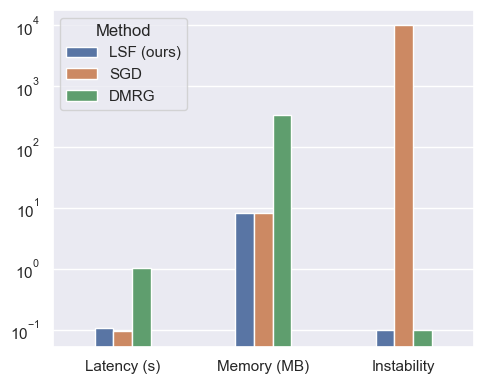

<h1 align="center">Efficient Probabilistic Tensor Networks</h1>

<p align="center">
  Train <strong>probabilistic tensor networks (PTNs)</strong> with
  <strong>logarithmic scale factors (LSF)</strong> for
  <strong>stable</strong> and <strong>fast</strong> learning.
</p>


<div align="center" style="display:flex; justify-content:center; gap:32px; align-items:center;">
  
  
</div>


## Installation

**Requirements:** Python 3.10+

```bash
# Install dependencies
# (optional) python -m venv .venv
pip install --upgrade pip
pip install -r requirements.txt
pip install -e .
# optional logging
pip install wandb && wandb login
```

## Training
Train $\mathrm{MPS}_{\sigma+\mathrm{LSF}}$
```bash

# Train on MNIST
python scripts/train_mnist.py --model mps --rank 8 --pos_func exp

# Train on UCLA datasets
python scripts/train_ucla.py --dataset nltcs --model mps --lr 5e-3  --rank 32 --pos_func abs
```

Train $\mathrm{MPS}_{\mathrm{BM+LSF}}$ models
```bash

# Train on MNIST
python scripts/train_mnist.py --model bmnc --rank 8

# Train on UCLA datasets
python scripts/train_ucla.py --dataset nltcs --model bmnc --lr 5e-3  --rank 32
```

## Evaluation

All training and validation metrics are automatically tracked and logged to [Weights & Biases (Wandb)](https://wandb.ai/).


## Reproducing Figures

The figures from the paper can be reproduced using the Jupyter notebook in `scripts/results.ipynb`. 